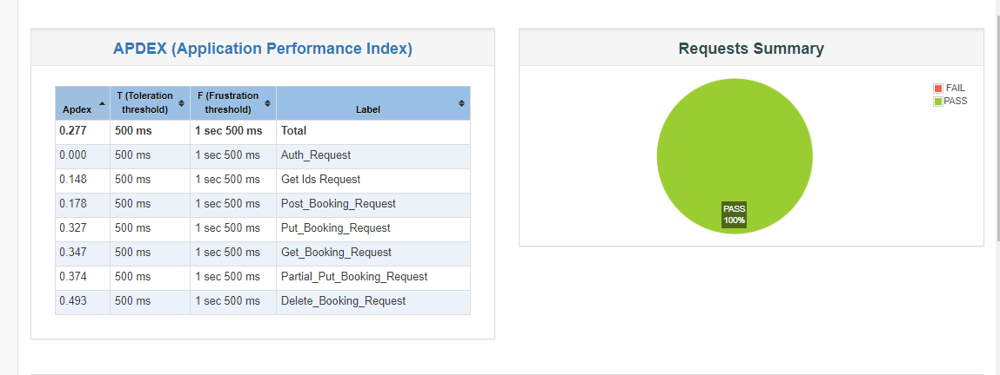
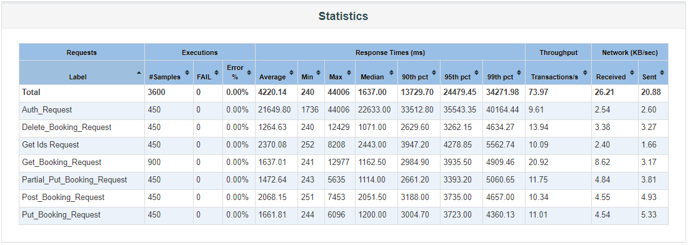
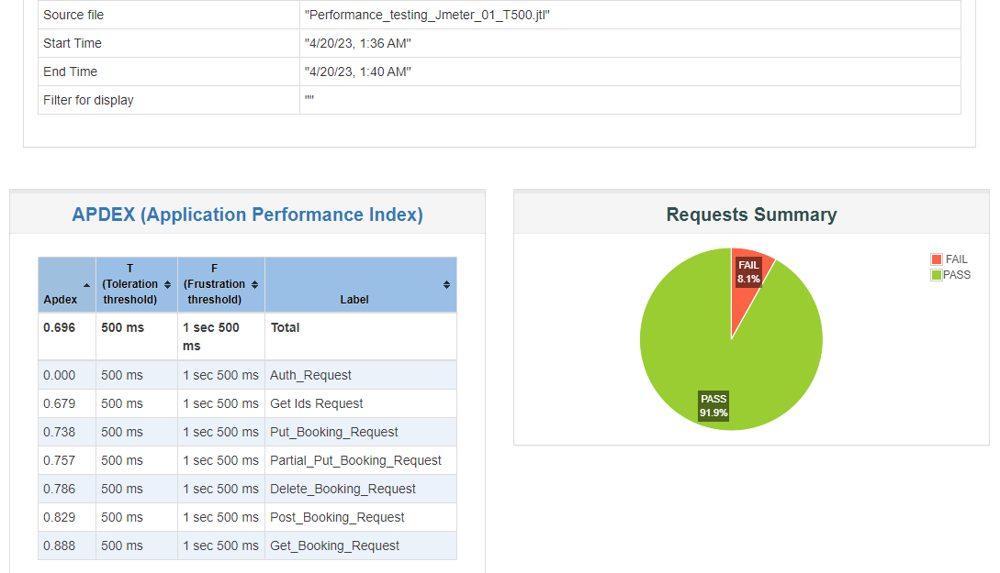
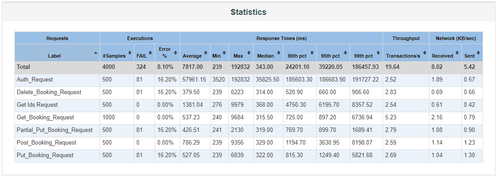

# Performance Testing using JMeter

[Introduction](https://github.com/Rabbi01521/Performance_Testing_Using_Jmeter#introduction)  
[Load Testing](https://github.com/Rabbi01521/Performance_Testing_Using_Jmeter#load-testing)  
[Stress Testing](https://github.com/Rabbi01521/Performance_Testing_Using_Jmeter#stress-testing)  

# Introduction

This document presents the results of performance tests conducted on six frequently used APIs of a demo website using JMeter, including load testing and stress testing.

Performance testing is an essential aspect of software development, as it helps to identify bottlenecks and areas for optimization. In this document, we present the results of performance tests conducted on a demo website, with the aim of evaluating the website's performance under different loads.

# Load Testing

We conducted load testing with 450 concurrent users and a 10-second ramp-up time.

**The test results showed a 0% error rate and a total throughput of 45.50 requests per second.**

  
  

# Stress Testing

We also conducted stress testing with 500 concurrent users and a 10-second ramp-up time.

**The results showed an 8.1% error rate and a total throughput of 51.93 requests per second.**

  
  

